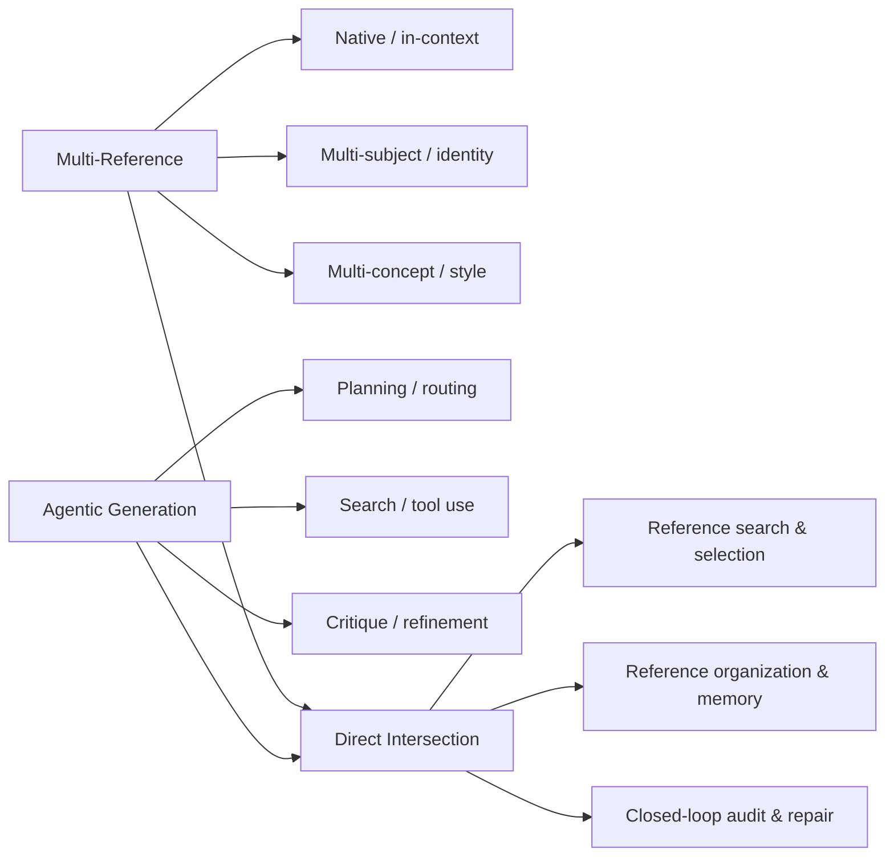

<h1 align="center">Awesome Multi-Reference & Agentic Image Generation</h1>

  A source-checked collection of papers, benchmarks, projects, and code for 
  <strong>multi-reference generation</strong>, <strong>agentic image generation</strong>,
  and their <strong>direct intersection</strong>.

  
  
  
  

  <a href="#start-here">Start Here</a> ·
  <a href="#latest-additions">Latest</a> ·
  <a href="#direct-intersection">Intersection</a> ·
  <a href="#full-collections">Full Lists</a> ·
  <a href="CONTRIBUTING.md">Contribute</a>

The collection uses primary paper sources and author-maintained artifacts. It
keeps strict intersections separate from adjacent work instead of treating any
retrieval, feedback loop, or multi-image input as both multi-reference and
agentic. New papers are reviewed manually before they are listed.

## Contents

- [Updates](#updates)
- [Research map](#research-map)
- [Start here](#start-here)
- [Latest additions](#latest-additions)
- [Direct intersection](#direct-intersection)
- [Full collections](#full-collections)
- [Related lists](#related-lists)
- [Contributing](#contributing)

## Updates

- **2026-08-29** — Initial public release with three source-checked tracks,
  dedicated benchmark sections, and a strict evidence matrix for intersection
  papers.

## Research map

| Track | Inclusion rule | Detailed index |
|---|---|---|
| **Direct intersection** | An agent plans, retrieves, selects, organizes, remembers, or repairs generation that explicitly uses multiple visual references or identities | [Methods, benchmarks, and two-axis evidence](papers/intersection.md) |
| **Multi-reference** | The method or benchmark explicitly handles multiple visual references, subjects, identities, concepts, or reference roles | [Methods, benchmarks, and foundations](papers/multi-reference.md) |
| **Agentic generation** | An LLM/VLM agent or explicit controller plans, calls tools, retrieves, critiques, remembers, collaborates, or revises across generation steps | [Methods and enabling work](papers/agentic.md) |

## Start here

A short route into the field before using the complete indexes.

### Multi-reference image generation

- [**Instruct-Imagen: Image Generation with Multi-modal Instruction**](https://arxiv.org/abs/2401.01952)
  — *CVPR 2024*. A foundational multimodal-instruction formulation that can
  combine heterogeneous image and text conditions. [Project](https://instruct-imagen.github.io/)
- [**OmniGen: Unified Image Generation**](https://arxiv.org/abs/2409.11340)
  — *CVPR 2025*. Treats text and multiple images as one instruction sequence.
  [Code](https://github.com/VectorSpaceLab/OmniGen)
- [**EasyRef: Omni-Generalized Group Image Reference for Diffusion Models via Multimodal LLM**](https://arxiv.org/abs/2412.09618)
  — *ICML 2025*. Aggregates a group of reference images and introduces
  MRBench. [Code](https://github.com/TempleX98/EasyRef)
- [**StructGen: Disambiguating Multi-Reference Image Generation via Structured Context Modeling**](https://arxiv.org/abs/2607.15619)
  — *arXiv 2026*. Structures subject and attribute relations before synthesis.
  [Project](https://jianingpeng0382.github.io/StructGen/)

### Agentic image generation

- [**Self-correcting LLM-controlled Diffusion Models**](https://arxiv.org/abs/2311.16090)
  — *CVPR 2024*. Uses an LLM controller to detect mismatches and repeatedly
  correct generation. [Project](https://self-correcting-llm-diffusion.github.io/) · [Code](https://github.com/tsunghan-wu/SLD)
- [**GenArtist: Multimodal LLM as an Agent for Unified Image Generation and Editing**](https://arxiv.org/abs/2407.05600)
  — *NeurIPS 2024 Spotlight*. Plans over specialist tools and performs
  stepwise verification. [Project](https://zhenyuw16.github.io/GenArtist_page/) · [Code](https://github.com/zhenyuw16/GenArtist)
- [**T2I-Copilot: A Training-Free Multi-Agent Text-to-Image System for Enhanced Prompt Interpretation and Interactive Generation**](https://arxiv.org/abs/2507.20536)
  — *ICCV 2025*. Coordinates interpretation, model selection, generation, and
  evaluation agents. [Repository](https://github.com/SHI-Labs/T2I-Copilot)
- [**GenEvolve: Self-Evolving Image Generation Agents via Tool-Orchestrated Visual Experience Distillation**](https://arxiv.org/abs/2605.21605)
  — *arXiv 2026*. Distills visual experience and tool-use trajectories into a
  self-improving agent. [Project](https://ephemeral182.github.io/GenEvolve/) · [Code](https://github.com/MeiGen-AI/GenEvolve)

### Multi-reference × agentic generation

- [**Idea2Img: Iterative Self-Refinement with GPT-4V(ision) for Automatic Image Design and Generation**](https://www.ecva.net/papers/eccv_2024/papers_ECCV/papers/05515.pdf)
  — *ECCV 2024*. Iteratively reasons over interleaved text and visual
  references. [Project](https://idea2img.github.io/) · [Code](https://github.com/zyang-ur/idea2img)
- [**ChatDiT: A Training-Free Baseline for Task-Agnostic Free-Form Chatting with Diffusion Transformers**](https://arxiv.org/abs/2412.12571)
  — *arXiv 2024*. Agents parse requests, choose relevant references, and plan
  generation or editing tools. [Project](https://ali-vilab.github.io/ChatDiT-Page/) · [Code](https://github.com/ali-vilab/ChatDiT)
- [**MultiRef: Controllable Image Generation with Multiple Visual References**](https://arxiv.org/abs/2508.06905)
  — *ACM Multimedia 2025 Dataset Track*. A multi-reference dataset and
  benchmark that explicitly evaluates agentic pipelines. [Project](https://multiref.github.io/) · [Code/Data](https://github.com/Dipsy0830/MultiRef-code)
- [**Qwen-Image-Agent: Bridging the Context Gap in Real-World Image Generation**](https://arxiv.org/abs/2606.26907)
  — *arXiv 2026*. Combines planning, visual search, memory, generation, and
  feedback over user, retrieved, and historical images.

## Latest additions

This section tracks recent additions by paper month; the detailed indexes carry
the full taxonomy and evidence.

| Date | Track | Paper | Resources |
|---|---|---|---|
| 2026-08 | Intersection | [**WithEveryone: Unified Planning and Identity Grounding for Group Image Generation**](https://arxiv.org/abs/2608.20336) | [Project](https://doby-xu.github.io/WithEveryone/) · [Repository](https://github.com/Doby-Xu/WithEveryone) |
| 2026-08 | Multi-reference benchmark | [**TRACE-Bench: Decomposing and Diagnosing Multi-Reference Image Generation**](https://arxiv.org/abs/2608.16765) | [Project](https://amuseum-whr.github.io/TraceBench/) |
| 2026-08 | Agentic | [**GenRouter: Unified Workflow Routing for Agentic Image Generation**](https://arxiv.org/abs/2608.16721) | [Code](https://github.com/EnVision-Research/GenRouter) |
| 2026-08 | Agentic | [**ToolArtist: Tool-Using Unified Multimodal Models for Agentic Image Generation**](https://arxiv.org/abs/2608.04436) | — |
| 2026-08 | Multi-reference | [**MultiCompose: Multi-Concept Personalized Composition with Per-Subject Attribute Binding**](https://arxiv.org/abs/2608.03708) | [Code](https://github.com/I2-Multimedia-Lab/MultiCompose) |
| 2026-07 | Multi-reference | [**StructGen: Disambiguating Multi-Reference Image Generation via Structured Context Modeling**](https://arxiv.org/abs/2607.15619) | [Project](https://jianingpeng0382.github.io/StructGen/) |
| 2026-06 | Multi-reference | [**Scaling Multi-Reference Image Generation with Dynamic Reward Optimization**](https://arxiv.org/abs/2606.26947) | [Code](https://github.com/Weistrass/DyRef) |
| 2026-06 | Intersection | [**Qwen-Image-Agent: Bridging the Context Gap in Real-World Image Generation**](https://arxiv.org/abs/2606.26907) | — |
| 2026-06 | Intersection | [**RS-Gen: A Multi-Stage Agentic Framework for Reasoning and Search-Augmented Image Generation**](https://arxiv.org/abs/2606.23221) | — |
| 2026-06 | Multi-reference benchmark | [**CogCanvas: A Benchmark for Evaluating Multi-Subject Reference-Based Image Generation**](https://arxiv.org/abs/2606.15867) | — |

## Direct intersection

The compact list below contains only methods and benchmarks that satisfy both
axes. Read the [full evidence matrix](papers/intersection.md) for separate
multi-reference and agentic evidence, narrower task settings, code status, and
adjacent bridges.

### 2026

| Paper | Venue / status | Resources |
|---|---|---|
| [**WithEveryone: Unified Planning and Identity Grounding for Group Image Generation**](https://arxiv.org/abs/2608.20336) | arXiv 2026 | [Project](https://doby-xu.github.io/WithEveryone/) · [Repository](https://github.com/Doby-Xu/WithEveryone) |
| [**Qwen-Image-Agent: Bridging the Context Gap in Real-World Image Generation**](https://arxiv.org/abs/2606.26907) | arXiv 2026 | — |
| [**RS-Gen: A Multi-Stage Agentic Framework for Reasoning and Search-Augmented Image Generation**](https://arxiv.org/abs/2606.23221) | arXiv 2026 | — |
| [**GenEvolve: Self-Evolving Image Generation Agents via Tool-Orchestrated Visual Experience Distillation**](https://arxiv.org/abs/2605.21605) | arXiv 2026 | [Project](https://ephemeral182.github.io/GenEvolve/) · [Code](https://github.com/MeiGen-AI/GenEvolve) |
| [**Breaking Dual Bottlenecks: Evolving Unified Multimodal Models into Self-Adaptive Interleaved Visual Reasoners**](https://arxiv.org/abs/2605.14709) | ICML 2026 | [Code](https://github.com/WeChatCV/Interleaved_Visual_Reasoner) |
| [**Self-Reasoning Agentic Framework for Narrative Product Grid-Collage Generation**](https://arxiv.org/abs/2604.16958) | arXiv 2026 | — |
| [**CANVAS: Continuity-Aware Narratives via Visual Agentic Storyboarding**](https://arxiv.org/abs/2604.13452) | arXiv 2026 | [Project](https://ishani-mondal.github.io/canvas-project-page/) |
| [**Unify-Agent: A Unified Multimodal Agent for World-Grounded Image Synthesis**](https://arxiv.org/abs/2603.29620) | arXiv 2026 | [Code](https://github.com/shawn0728/Unify-Agent) |
| [**Gen-Searcher: Reinforcing Agentic Search for Image Generation**](https://arxiv.org/abs/2603.28767) | arXiv 2026 | [Project](https://gen-searcher.vercel.app/) · [Code](https://github.com/tulerfeng/Gen-Searcher) |
| [**Mind-Brush: Integrating Agentic Cognitive Search and Reasoning into Image Generation**](https://arxiv.org/abs/2602.01756) | arXiv 2026 | [Code](https://github.com/PicoTrex/Mind-Brush) |
| [**3D Space as a Scratchpad for Editable Text-to-Image Generation**](https://arxiv.org/abs/2601.14602) | CVPR 2026 | [Project](https://oindrilasaha.github.io/3DScratchpad/) |
| [**AutoStudio: Crafting Consistent Subjects in Interactive Story Generation**](https://openaccess.thecvf.com/content/CVPR2026W/AISTORY/html/Cheng_AutoStudio_Crafting_Consistent_Subjects_in_Interactive_Story_Generation_CVPRW_2026_paper.html) | CVPR 2026 Workshops | [Code](https://github.com/donahowe/AutoStudio) |
| [**BOOKAGENT: Orchestrating Safety-Aware Visual Narratives via Multi-Agent Cognitive Calibration**](https://aclanthology.org/2026.findings-acl.108/) | Findings of ACL 2026 | [Repository](https://github.com/bogao-code/BookAgent) |
| [**MultiBanana: A Challenging Benchmark for Multi-Reference Text-to-Image Generation**](https://openaccess.thecvf.com/content/CVPR2026/html/Oshima_MultiBanana_A_Challenging_Benchmark_for_Multi-Reference_Text-to-Image_Generation_CVPR_2026_paper.html) | CVPR 2026 · Benchmark | [Code/Data](https://github.com/matsuolab/multibanana) |

### 2025

| Paper | Venue / status | Resources |
|---|---|---|
| [**Visual-Aware CoT: Achieving High-Fidelity Visual Consistency in Unified Models**](https://arxiv.org/abs/2512.19686) | arXiv 2025 | [Project](https://zixuan-ye.github.io/VACoT/) |
| [**World-To-Image: Grounding Text-to-Image Generation with Agent-Driven World Knowledge**](https://arxiv.org/abs/2510.04201) | arXiv 2025 | [Code](https://github.com/mhson-kyle/World-To-Image) |
| [**MultiRef: Controllable Image Generation with Multiple Visual References**](https://arxiv.org/abs/2508.06905) | ACM Multimedia 2025 Dataset Track · Benchmark | [Project](https://multiref.github.io/) · [Code/Data](https://github.com/Dipsy0830/MultiRef-code) |
| [**Audit & Repair: An Agentic Framework for Consistent Story Visualization in Text-to-Image Diffusion Models**](https://arxiv.org/abs/2506.18900) | arXiv 2025 | [Project](https://auditandrepair.github.io/) |
| [**LayerCraft: Enhancing Text-to-Image Generation with CoT Reasoning and Layered Object Integration**](https://papers.nips.cc/paper_files/paper/2025/file/bf2a5ce85aea9ff40d9bf8b2c2561cae-Paper-Conference.pdf) | NeurIPS 2025 | [Code](https://github.com/PeterYYZhang/LayerCraft) |
| [**AgentStory: A Multi-Agent System for Story Visualization with Multi-Subject Consistent Text-to-Image Generation**](https://doi.org/10.1145/3731715.3733271) | ACM ICMR 2025 | [Repository](https://github.com/tc2000731/AgentStory) |
| [**Storybooth: Training-free Multi-Subject Consistency for Improved Visual Storytelling**](https://arxiv.org/abs/2504.05800) | ICLR 2025 | — |
| [**VisAgent: Narrative-Preserving Story Visualization Framework**](https://arxiv.org/abs/2503.02399) | ICASSP 2025 | — |
| [**AutoStory: Generating Diverse Storytelling Images with Minimal Human Efforts**](https://doi.org/10.1007/s11263-024-02309-y) | IJCV 2025 | [Project](https://aim-uofa.github.io/AutoStory/) · [Code](https://github.com/aim-uofa/AutoStory) |

### 2024

| Paper | Venue / status | Resources |
|---|---|---|
| [**ChatDiT: A Training-Free Baseline for Task-Agnostic Free-Form Chatting with Diffusion Transformers**](https://arxiv.org/abs/2412.12571) | arXiv 2024 | [Project](https://ali-vilab.github.io/ChatDiT-Page/) · [Code](https://github.com/ali-vilab/ChatDiT) |
| [**TheaterGen: Character Management with LLM for Consistent Multi-turn Image Generation**](https://arxiv.org/abs/2404.18919) | arXiv 2024 | [Project](https://howe140.github.io/theatergen.io/) · [Code](https://github.com/donahowe/Theatergen) |
| [**Divide and Conquer: Language Models can Plan and Self-Correct for Compositional Text-to-Image Generation**](https://arxiv.org/abs/2401.15688) | arXiv 2024 | [Project](https://zhenyuw16.github.io/CompAgent/) · [Repository](https://github.com/zhenyuw16/CompAgent_code) |
| [**Idea2Img: Iterative Self-Refinement with GPT-4V(ision) for Automatic Image Design and Generation**](https://www.ecva.net/papers/eccv_2024/papers_ECCV/papers/05515.pdf) | ECCV 2024 | [Project](https://idea2img.github.io/) · [Code](https://github.com/zyang-ur/idea2img) |

## Full collections

<strong>Multi-reference image generation</strong>

- [Native multi-reference and interleaved-context generation](papers/multi-reference.md#1-native-multi-reference-and-interleaved-context-generation)
- [Multi-subject and multi-identity personalization](papers/multi-reference.md#2-multi-subject-and-multi-identity-personalization)
- [Multi-concept and content–style composition](papers/multi-reference.md#3-multi-concept-and-contentstyle-composition)
- [Multiple-image aggregation for one identity or concept](papers/multi-reference.md#4-multiple-image-aggregation-for-one-identity-or-concept)
- [Dedicated benchmarks and datasets](papers/multi-reference.md#5-dedicated-benchmarks-and-datasets)
- [Background foundations](papers/multi-reference.md#6-background-foundations--not-counted-as-direct-multi-reference-papers)

<strong>Agentic image generation and editing</strong>

- [Direct agentic methods](papers/agentic.md#direct-agentic-image-generation)
- [2026 papers](papers/agentic.md#2026)
- [2025 papers](papers/agentic.md#2025)
- [2024 and earlier](papers/agentic.md#2024-and-earlier)
- [Adjacent and enabling work](papers/agentic.md#adjacent--enabling-work)

<strong>Multi-reference × agentic generation</strong>

- [Strict direct intersection with separate Axis A / Axis B evidence](papers/intersection.md#direct-intersection)
- [Adjacent bridges](papers/intersection.md#adjacent-bridges)
- [Scope and counting rules](papers/intersection.md#scope-and-counting-rules)

## Related lists

- [Awesome Multi-Image Generation](https://github.com/ATH-MaaS/Awesome-Multi-Image-Generation)
- [Awesome Personalized Image Generation](https://github.com/csyxwei/Awesome-Personalized-Image-Generation)
- [Awesome Image Generation with Thinking](https://github.com/exped1230/Awesome_Image_Generation_with_Thinking)
- [Awesome Text-to-Image](https://github.com/Yutong-Zhou-cv/Awesome-Text-to-Image)
- [Awesome Image Editing](https://github.com/FudanCVL/Awesome-Image-Editing)

## Contributing

Paper additions and corrections are welcome. Please read
[CONTRIBUTING.md](CONTRIBUTING.md), then use the
[paper suggestion form](https://github.com/zsyverse/awesome-multi-reference-agentic-image-generation/issues/new?template=paper.yml)
or open a pull request.

Every addition must include an exact title, a primary paper source, an accurate
venue or review status, official project/code links when available, and one
sentence explaining why it belongs. Preprints and submissions are never labeled
as accepted without an official proceedings page or decision.

Maintainer resources: [curation references](docs/reference-repositories.md) ·
[maintenance guide](.github/MAINTAINING.md)

Released under the [MIT License](LICENSE).
